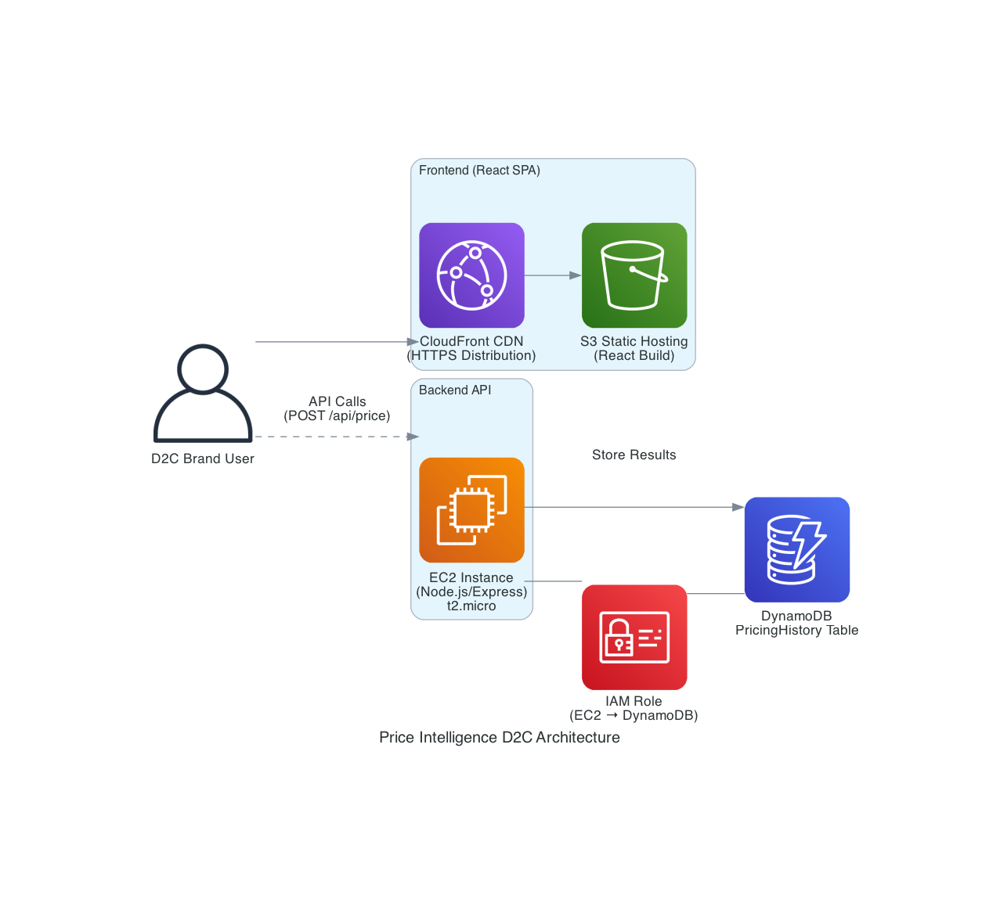

# Price Intelligence Tracker -- Project Summary

A full-stack web application that helps Direct-to-Consumer (D2C) brands make data-driven pricing decisions. The system combines rule-based pricing algorithms with generative AI to deliver optimal price recommendations, markdown timing, and strategic insights in real time.

---

## Architecture



| Layer         | Technology                                         |
| ------------- | -------------------------------------------------- |
| Frontend      | React 18, React Router v6, Recharts, Lucide Icons  |
| Backend       | Node.js 18 + Express 4                             |
| Database      | AWS DynamoDB (on-demand, serverless)               |
| AI Model      | Amazon Nova 2 Lite (generative AI insights)        |
| CDN           | AWS CloudFront (HTTPS distribution)                |
| Static Assets | AWS S3 (React production build)                    |
| Compute       | AWS EC2 t2.micro (Node.js API server)              |
| IAM           | EC2 instance role with DynamoDB access policy       |

All AWS services used are within the **Free Tier** (12-month new-account limits).

---

## Features

### 1. Price Calculator

Single-product analysis tool. Users enter a product ID, their current price, a competitor's price, and an optional demand-elasticity factor. The backend applies configurable business rules:

| Condition                          | Optimal Price     | Markdown Timing |
| ---------------------------------- | ----------------- | --------------- |
| Own > Competitor x 1.1             | Competitor x 1.05 | Immediate       |
| Own < Competitor x 0.9             | Own Price (hold)  | Hold            |
| Competitive range, elasticity > 1  | Competitor x 0.98 | Monitor         |
| Competitive range, elasticity <= 1 | Competitor x 1.02 | Monitor         |

After computing the recommendation, the system calls **Amazon Nova 2 Lite** to generate a natural-language strategic insight covering competitive positioning, risk factors, and actionable next steps. This AI insight is displayed alongside the numerical recommendation.

### 2. Bulk Analysis

Upload or manually enter multiple products at once. The system runs pricing analysis across the entire batch and produces:

- Per-product optimal price, markdown timing, and price gap vs. competitor
- Revenue impact projections based on elasticity-adjusted demand modeling
- Aggregate summary: count of immediate actions, hold recommendations, and monitor recommendations
- Downloadable results

### 3. Analytics Dashboard

A real-time dashboard with four KPI stat cards, interactive charts, and AI-generated portfolio insights:

- **Stat cards**: Total analyses, unique products tracked, analyses in last 30 days, average optimal price
- **Pie chart**: Markdown timing distribution (Immediate / Monitor / Hold)
- **Bar chart**: Recent product activity volume
- **AI Portfolio Insights**: On page load, the dashboard sends aggregate statistics to **Amazon Nova 2 Lite**, which returns a portfolio health assessment covering trends, risks, and priority actions
- **Recent products**: Quick-access list of recently analyzed products

### 4. Pricing History

Searchable, filterable history of all pricing analyses stored in DynamoDB:

- Full-text search across product IDs
- Filter by product and date range
- Interactive line chart showing price trends (optimal, own, competitor) for a selected product
- Tabular view with sortable columns and timing badges

### 5. Price Alerts

Configurable alert system for monitoring price thresholds:

- Create alerts with custom thresholds and alert types
- Alert states: Active, Triggered, Paused
- Toggle, pause, resume, or delete alerts
- Alert statistics summary panel
- Modal-based alert creation form

### 6. AI-Powered Insights (Amazon Nova 2 Lite)

Generative AI is integrated at two points in the application:

- **Price Calculator Insight**: After each single-product analysis, the system sends the full pricing context (product, prices, elasticity, recommendation, timing) to Amazon Nova 2 Lite. The model returns 3-4 strategic bullet points explaining why the recommendation makes sense, how the brand is positioned competitively, what risks exist, and what to do next.

- **Dashboard Portfolio Summary**: When the dashboard loads with existing data, aggregate portfolio statistics are sent to Amazon Nova 2 Lite. The model returns a portfolio health assessment covering overall pricing health, the most pressing opportunity or risk, a trend observation, and a recommended priority action.

Both AI features degrade gracefully -- if the AI service is unavailable, the rest of the application functions normally.

---

## API Endpoints

| Method | Endpoint                          | Description                              |
| ------ | --------------------------------- | ---------------------------------------- |
| POST   | `/api/price`                      | Calculate optimal pricing for one product |
| GET    | `/api/price/history`              | Retrieve all pricing history             |
| POST   | `/api/price/bulk`                 | Bulk pricing analysis for multiple products |
| GET    | `/api/analytics/trends/:productId`| Price trend analysis for a specific product |
| GET    | `/api/analytics/dashboard`        | Dashboard summary statistics             |
| POST   | `/api/ai/pricing-insight`         | Generate AI strategic insight for a pricing result |
| POST   | `/api/ai/dashboard-summary`       | Generate AI portfolio summary from dashboard stats |
| GET    | `/api/health`                     | Health check                             |

---

## Project Structure

```
Price-Intelligence-Tracker/
├── backend/
│   ├── server.js            # Express server, routes, DynamoDB integration
│   ├── pricingLogic.js      # Core pricing rules, trend analysis, bulk analysis
│   ├── aiService.js         # Amazon Nova 2 Lite integration for AI insights
│   ├── .env.example         # Environment variable template
│   └── package.json
├── frontend/
│   ├── public/
│   │   └── index.html
│   ├── src/
│   │   ├── App.js           # Root component with React Router
│   │   ├── App.css
│   │   ├── index.js         # React entry point
│   │   ├── index.css        # Global styles and CSS variables
│   │   └── components/
│   │       ├── Layout.js / .css        # Sidebar navigation + main content layout
│   │       ├── Dashboard.js / .css     # Analytics dashboard with charts
│   │       ├── PricingForm.js / .css   # Single-product price calculator
│   │       ├── ResultCard.js / .css    # Pricing recommendation display
│   │       ├── AiInsight.js / .css     # AI insight card (reusable)
│   │       ├── BulkAnalysis.js / .css  # Multi-product batch analysis
│   │       ├── PricingHistory.js / .css# Historical pricing data with charts
│   │       └── PriceAlerts.js / .css   # Alert management system
│   ├── .env.example
│   └── package.json
├── generated-diagrams/
│   └── price-intelligence-architecture.png.png
├── README.md
└── PROJECT_SUMMARY.md
```

---

## AWS Services Used

| Service       | Purpose                                                        |
| ------------- | -------------------------------------------------------------- |
| **EC2**       | t2.micro instance running the Node.js/Express backend API      |
| **DynamoDB**  | NoSQL database storing all pricing analysis history            |
| **S3**        | Static hosting for the React production build                  |
| **CloudFront**| CDN with HTTPS for serving the frontend globally               |
| **IAM**       | Instance role granting EC2 secure access to DynamoDB           |
| **Amazon Nova 2 Lite** | Generative AI model for strategic pricing insights  |

---

## UI Design

The frontend features a professional blue-themed design system:

- **Sidebar navigation**: Dark navy sidebar with blue accent highlights and five navigation sections (Dashboard, Price Calculator, Bulk Analysis, Pricing History, Price Alerts)
- **CSS custom properties**: Centralized color palette using CSS variables for consistent theming
- **Responsive layout**: Full-width dashboard layout that adapts to mobile with a collapsible horizontal nav
- **Interactive charts**: Recharts-powered pie charts (markdown distribution) and bar charts (product activity) with blue color scheme
- **AI insight cards**: Distinctive cards with blue-left-border accent, gradient background, shimmer loading animation, and "AI" badge
- **Semantic color coding**: Red for Immediate actions, green for Hold, amber for Monitor -- used consistently across badges, summary cards, and charts

---

## Key Technical Decisions

- **Backend-proxied AI**: The frontend never calls the AI model directly. All AI requests are routed through the Express backend, keeping credentials secure on the server.
- **Graceful degradation**: The AI features are additive. If the AI service is unreachable or unconfigured, every other feature (pricing calculator, bulk analysis, history, alerts, dashboard) works exactly as expected.
- **DynamoDB with in-memory fallback**: For local development without AWS credentials, the backend automatically falls back to in-memory storage -- no setup required.
- **Lazy-loaded routes**: Pricing History and Price Alerts components are lazy-loaded with React.lazy() to optimize initial bundle size.
- **Elasticity-adjusted demand modeling**: The bulk analysis engine projects revenue impact by computing price-induced demand shifts using the elasticity factor, giving brands a tangible financial forecast.

---

## Environment Variables

### Backend (`backend/.env`)

| Variable         | Description                                 |
| ---------------- | ------------------------------------------- |
| `PORT`           | Server port (default: 5000)                 |
| `CORS_ORIGIN`    | Comma-separated allowed origins             |
| `AWS_REGION`     | AWS region for DynamoDB (default: us-east-1)|
| `DYNAMODB_TABLE` | DynamoDB table name (default: PricingHistory)|
| `API_KEY`        | API key for Amazon Nova 2 Lite              |

### Frontend (`frontend/.env`)

| Variable                 | Description                   |
| ------------------------ | ----------------------------- |
| `REACT_APP_BACKEND_URL`  | Backend API base URL          |

---

## License

This project is a prototype for educational and demonstration purposes.
